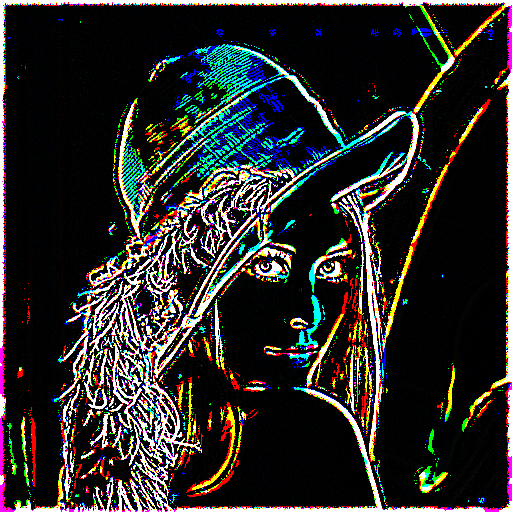

<a name="Preprocessing"/>
[]()
# Preprocess the Ground #
Preprocessing is used to analyse and optimize the statistical properties of datasets such that they are easier to push through neural networks.

  * [Preprocess](#dp.Preprocess)
    * [Standardize](#dp.Standardize) : subtract the mean and divide by the standard deviation;
    * [GCN](#dp.GCN) : Global Contrast Normalization;
    * [ZCA](#dp.ZCA) : Zero Component Analysis whitening;
    * [LeCunLCN](#dp.LeCunLCN) : Yann LeCun's Local Contrast Normalization;

<a name="dp.Preprocess"/>
[]()
## Preprocess ##
Abstract class.

An object that can preprocess a [View](view.md#dp.View).
Preprocessing a View implies changing the data that
it actually stores. This can be useful to save
memory. If you know you are always going to access only
the same processed version of the dataset, it is better
to process it once and discard the original.

Preprocesses are capable of modifying many aspects of
a View. For example, they can change the way that it
converts between different formats of data. They can
change the number of examples that a View stores.
In other words, preprocesses can do a lot more than
just example-wise transformations of the examples stored
in a View.

<a name="dp.Preprocess.apply"/>
[]()
### apply(view, can_fit) ###
Abstract method.

  * `view` is the [View](view.md#dp.View) to act upon.
  * `can_fit`. When true, the Preprocess can adapt internal parameters based on the contents of the `view`. This is usually true for input Views taken from the training DataSet.

For example, let us preprocess the [Mnist](data.md#dp.Mnist) inputs. First, we load the datasource and create a [Standardize](#dp.Standardize) preprocess.
```lua
ds = dp.Mnist()
st = dp.Standardize()
```
Get the `train`, `valid` and `test` set inputs.
```lua
train = ds:trainSet():inputs()
valid = ds:validSet():inputs()
test = ds:testSet():inputs()
```
Fit and apply the preprocess to the `train` View.
```lua
st:apply(train, true)
```
At this point the `st` Preprocess has measured and stored some statistics gathered from the `train` View. Furthermore, the `train` View has been preprocessed. We can apply the same preprocessing (with the same statistics) on the the `valid` and `test` Views.
```lua
st:apply(valid, false)
st:apply(test, false)
```
Since this is a common pattern in machine learning, we have simplified all of the above to one line of code.
```lua
ds = Mnist{input_preprocess=dp.Standardize()}
```

<a name="dp.Standardize"/>
[]()
## Standardize ##
A [Preprocess](#dp.Preprocess) that subtracts the mean and divides by the standard deviation. Uses the _bf_ `view`.

<a name="dp.Standardize.__init"/>
[]()
### dp.Standardize{[...]} ###
Constructs a Standardize Preprocess. Arguments should be specified as key-value pairs.
 
  * `global_mean` is a boolean with a default value of `false`. When true, subtracts the (scalar) mean over every element in the datset. Otherwise, subtract the mean from each column (feature) separately. 
  * `global_std` is a boolean with a default value of `false`. When true, after centering, divides by the (scalar) standard deviation of every element in the design matrix. Otherwise, divide by the column-wise (per-feature) standard deviation.
  * `std_eps` is a number with a default value of `1e-4`. It is a stabilization factor added to the standard deviations before dividing. This prevents standard deviations very close to zero from causing the feature values to blow up too much.

<a name="dp.GCN"/>
[]()
## GCN ##
Performs Global Contrast Normalization by (optionally) subtracting the 
mean across features and normalizing by either 
the vector norm or the standard deviation (across features, for 
each example).

<a name="dp.GCN.__init"/>
[]()
### dp.GCN{[...]} ###
Constructs a GCN Preprocess. Arguments should be specified as key-value pairs:
  
  * `substract_mean` is a boolean with a default value of true. Remove the mean across features/pixels before normalizing. Note that this is the per-example mean across pixels, not the per-pixel mean across examples.
  * `scale` is a number with a default value of 1.0. Multiply features by this constant.
  * `sqrt_bias` is a number with a default value of 0. A fudge factor added inside the square root. Adds this amount inside the square root when computing the standard deviation or the norm.
  * `use_std` is a boolean with a default value of false. If True uses the standard deviation instead of the norm.
  * `min_divisor` is a number with a default value of 1e-8. If the divisor for an example is less than this value, do not apply it.
  * `batch_size` is a number with a default value 0. The size of a batch used internally.
       
Note that `sqrt_bias = 10`, `use_std = true` and defaults for all other
parameters corresponds to the preprocessing used in :
A. Coates, H. Lee and A. Ng. [An Analysis of Single-Layer
Networks in Unsupervised Feature Learning](http://www.stanford.edu/~acoates/papers/coatesleeng_aistats_2011.pdf). AISTATS 14, 2011.

<a name="dp.ZCA"/>
[]()
## ZCA ##
Performs Zero Component Analysis Whitening.
Commonly used for images, yet uses the _bf_ `view`. 
For a comprehensize explanation of ZCA Whitening please consult the [Standford Whitening article](http://ufldl.stanford.edu/wiki/index.php/Whitening)

<a name="dp.ZCA.__init"/>
[]()
### dp.ZCA{[...]} ###
Constructs a ZCA Preprocess. Arguments should be specified as key-value pairs.
  
  * `n_component` measures the number of most important eigen components to use for ZCA. The default is to use all of components.
  * `n_drop_component` is the number of least important eigen components to drop. The default value is 0.
  * `filter_bias` is a number with a default value of 0.1. Filters are scaled by `1/sqrt(filter_bias + variance)`.

<a name="dp.LeCunLCN"/>
[]()
## LeCunLCN ##
Implements the Local Contrast Normalization Layer at page 3 in
[What is the Best Multi-Stage Architecture for Object Recognition?](http://yann.lecun.com/exdb/publis/pdf/jarrett-iccv-09.pdf).

Performs local subtractive and divisive normalization
enforcing a sort of local competition between adjacent features
in a feature map, and between features at the same spatial location in different feature maps.
The subtractive normalization operation for a given site `x[i][j][k]` computes
`v[i][j][k] = x[i][j][k] − ( w[p][q]x[1][1+p][1+q] + ... + w[p][q]x[i][j+p][k+q]) + ...`, where `w[p][q]`
is a Gaussian weighting window (of default size `9 x 9`) normalized so that `w[1][1] + ... + w[pq] + ... = 1`.

The divisive normalization computes `y[i][j][k] = v[i][j][k]/max(c, σ[j][k])`
where `σ[j][k] = pow(w[1][1]pow(v[1][j+p][k+q],2) + ... + w[p][q]pow(v[i][j+p][k+q],2), 2), 2)`.
For each sample, the constant `c` is set to the `mean(σ[j][k])` in the experiments
The denominator is the weighted standard deviation of all features 
over a spatial neighborhood. 

As an example, here is Lenna before :

 

and after LeCunLCN preprocessing:

.

<a name="dp.LeCunLCN.__init"/>
[]()
### dp.LeCunLCN{[...]} ###
Constructs a LeCunLCN Preprocess. Arguments should be specified as key-value pairs.

  * `kernel_size` is the local contrast kernel size. Default is 9.
  * `threshold` is the minimum threshold for using values as denomitators. Default is 0.0001.
  * `batch_size` used for performing the preprocessing. Default is 256.
  * `channels` is a list (table) of channels (colors) to normalize. Defaults to `{1,2,3}`.
  * `progress` is a boolean specifying whether a progress bar should be displayed.
